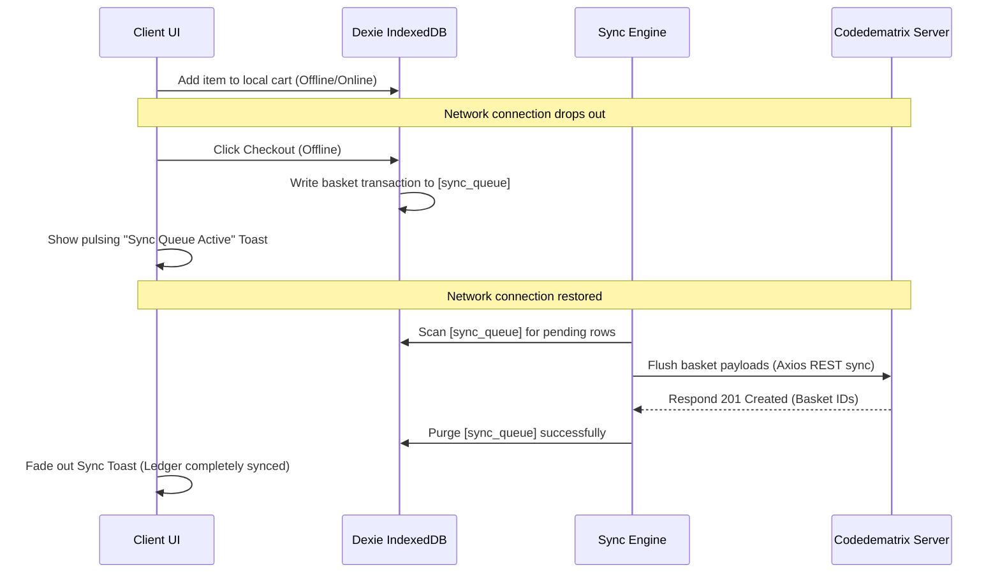

# Phasion Sense // Amina Stitches Studio
> Premium, offline-first contemporary fashion retail engine optimized for real-world network and transactional environments.

---

## 🌟 The Vision

**Phasion Sense** is an elite, high-fidelity Progressive Web Application (PWA) storefront tailored specifically for the contemporary African fashion brand track **`amina-stitches`**. Inspired by standard-setting minimalist editorial interfaces, Phasion Sense marries high-end brand visuals with industrial-grade resilience in real-world mobile environments. 

Through standard-setting design and resilient network and financial boundary engineering, Phasion Sense ensures that retail transactions remain uninterrupted under the most challenging connectivity and financial network conditions.

---

## 🚀 Key Architectural Enhancements

### 1. ⚡ Ultra-Low-Data Eco Mode (Bandwidth Optimizer)
* **Problem:** Under volatile mobile networks or expensive cell data packages, standard high-fidelity Ankara/Kente collection lookbooks (3/4 aspect ratio images) fail to load or consume costly user data.
* **Solution:** An interactive global **Eco-Mode Toggle** in the navigation bar backed by a Zustand preference store interceptor. When active, it instantly caps high-bandwidth lookbook asset loading, replacing image fetches with CSS typography-based bounding cards and data preservation capsules. This reduces data consumption by up to **90%** while maintaining store browse interactivity.

### 💳 2. Live Localized MoMo Fee Estimator
* **Problem:** In real-world retail networks, Mobile Money (MoMo) payments represent the primary checkout line but are subject to varying merchant/escrow processing rates. Hiding these transactional overhead costs until payment authorization degrades user trust.
* **Solution:** Under the hood, the shopping bag drawer computes a real-time **1% Mobile Money processing fee line** over the cart subtotal, projecting a clear, commercially viable **Gross Total Summary** before proceeding to checkout.

### 📡 3. Dexie IndexedDB Offline Queue status Toast
* **Problem:** If a customer initiates a transaction offline, standard applications fail out, resulting in cart abandonment.
* **Solution:** When offline, order requests are caught by our Axios/Navigator interceptor, converted into sequential transactions, and secured inside a local `sync_queue` table in **Dexie.js (IndexedDB wrapper)**. A gold-accented, pulsing **Offline Queue Status Toast** warns the user of pending sync actions and automatically flushes the queue once connection ping pings succeed.

### 👗 4. Virtual Try-On Fitting Suite (AI IDM-VTON Edge)
* **Problem:** Retail shoppers want to see custom sleeve shapes and Ankara coordinates on their own body contours.
* **Solution:** Integrates an Image-based Diffusion Model (IDM-VTON) try-on canvas. Pre-compresses client selfies using local canvas downsamplers to preserve bandwidth, uploads them to secure storage buffers, and performs remote try-on generation, allowing users to verify garment fits in real-time.

---

## 🛠️ Technology Stack

| Core Technology | Selection & Role |
| :--- | :--- |
| **Frontend Framework** | **Next.js 14 (App Router) + TypeScript** |
| **PWA Engine** | **`next-pWA` + Workbox Service Workers** (pre-caches premium Outfit & Playfair Display typography, UI styles, and skeletons for complete offline load) |
| **Local Database** | **Dexie.js (IndexedDB wrapper)** (provides asynchronous, promise-based transactional storage with massive storage buffers for catalog caching and transaction logs) |
| **State Management** | **Zustand** (lightweight, highly optimized global storefront store) |
| **Network Client** | **Axios** (equipped with request/response interceptors that catch network transport errors and divert payloads directly to local IndexedDB writes when offline) |
| **Styling** | **TailwindCSS** (Vanilla HSL-curated palette with glassmorphism overlays and gold `#d4af37` editorial accents) |

---

## 📂 Complete Directory Tree

```text
.
├── public/
│   ├── icon-192x192.png
│   ├── icon-512x512.png
│   ├── manifest.json
│   └── sw.js
├── src/
│   ├── app/
│   │   ├── layout.tsx       # Root layout, metadata & custom Outfit/Playfair typography
│   │   ├── page.tsx         # main Storefront Studio & Eco-Toggle NavBar
│   │   ├── checkout/        # intake form, bag review & WhatsApp compiler link checkout
│   │   └── try-on/          # VTO fitting suite with Suspense CSR guards
│   ├── components/
│   │   ├── cart-drawer.tsx  # Live MoMo fee calculator & Gross Total drawer
│   │   ├── inventory-grid.tsx # Eco-Mode bandwidth interceptor & product catalog grids
│   │   ├── offline-banner.tsx # Live browser network status monitor banner
│   │   └── sync-toast.tsx   # pulsing Dexie DB background sync queue toast
│   ├── db/
│   │   ├── DexieDB.ts       # Database schemas (cached_items, cached_campaigns, sync_queue)
│   ├── services/
│   │   ├── api-client.ts    # Interceptor-hardened Axios network transportation line
│   │   └── syncEngine.ts    # Sequential offline transactional queue processor
│   ├── store/
│   │   ├── cartStore.ts     # zustand cart state manager
│   │   ├── catalogStore.ts  # zustand catalog state & offline IndexedDB buffer hydrating
│   │   └── appPreferencesStore.ts # zustand Eco Mode store
│   └── utils/
│       ├── currency.ts      # pesewas-to-cedi format helper
│       └── whatsappCompiler.ts # WhatsApp transaction invoice compiler
├── package.json
└── tsconfig.json
```

---

## 🚀 Getting Started

### 1. Install Project Dependencies
Run the package manager setup to populate local modules:
```bash
npm install
```

### 2. Launch Local Development Server
Boot up the dev server:
```bash
npm run dev
```
Open [http://localhost:3000](http://localhost:3000) in your web browser.

### 3. Compile Production Bundle
Test standard-setting type checking and build optimizations:
```bash
npm run build
```

---

## 🔒 The Resiliency Loop (How Sync Works)



Phasion Sense guarantees that a customer order is **never lost**. Whether a buyer completes their handshake checkout online or entirely in remote connectivity, the engine compiles a structured WhatsApp order invoice directly, adapting automatically to keep business pipelines moving.
