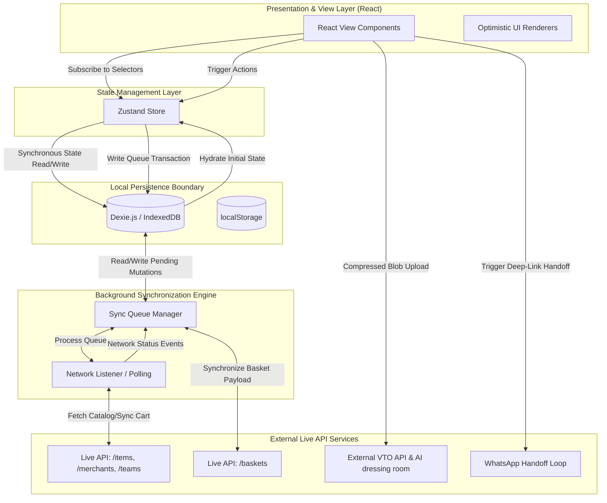

# MISSION: Solution Architecture

## INSTRUCTIONS FOR AI AGENT
Review the deconstructed analysis in `Problem.md`. Based *only* on that foundational understanding, propose a comprehensive solution plan. Focus on the mechanics of the solution, system architecture, and local data operations. 

Do not define specific libraries or code file structures yet; focus on *how* the system will structurally solve the reframed root problem.

## STRUCTURAL SOLUTION ARCHITECTURE BLUEPRINT

### 1. High-Level System Architecture

The architecture decouples view state, synchronous global business logic, persistent local caching, and remote asynchronous synchronization. This ensures that the application remains extremely responsive and operational even under complete network failure.



#### Layer Mechanics
* **Presentation Layer (React Views & Optimistic UI):** Contains our contemporary "Phasion Sense" storefront views. Views never trigger direct asynchronous HTTP calls at runtime. Instead, they interact entirely with Zustand hooks. Views register optimistic render paths that execute immediately upon state changes.
* **State Management Layer (Zustand Global Store):** The synchronous CPU-level brain. It maintains the in-memory active catalog state, current user registration, active cart items, sync queue length, and VTO status. When an action is dispatched (e.g., adding an item), Zustand immediately modifies its internal state, triggers a UI rerender, and queues the mutation in IndexedDB.
* **Offline Caching & Persistence Boundary (IndexedDB via Dexie.js):** The transactional database. It stores structured records under three key schemas:
  * `catalog`: Locally cached products, sizes, prices, and imagery.
  * `local_cart`: The user's active shopping cart, including selected sizes, quantities, and customized customer notes.
  * `sync_queue`: A resilient, FIFO transactional log of pending outbound mutations (e.g., cart adjustments, registration updates) marked with state flags (`PENDING`, `SYNCING`, `FAILED`).
  * *Note: localStorage is used for lightweight, non-relational configurations (e.g., theme settings, active team slug).*
* **Background Synchronization Engine (Sync Queue Manager):** An independent logical routine that checks for network presence. It runs on browser network transitions and interval-based pings, pulling outstanding records from the IndexedDB `sync_queue` and transmitting them in strict order to the live backend endpoints while protecting against duplicate processing.
* **Remote Service Layer (Live API Endpoints):** Replicated cloud services for live database operations. When online, requests fetch fresh catalog states, campaigns, and team profiles. External VTO endpoints process image uploads, while checkout payloads compile into standardized deep-links that hand off tracking and checkout loops directly to WhatsApp.

---

### 2. Core Features & Modules (MVP)

We group our MVP modules by system priorities to guarantee a rich contemporary fashion experience under constraints:

#### Critical (Tier 1) — Foundation & Transaction Core
* **Deterministic Local Cart State Machine:**
  * *Responsibility:* A self-contained logic engine within Zustand that executes cart state changes. It manages state transitions mathematically: ensuring size variations are validated, recalculating item counts, tracking product identifiers, and appending custom user design notes. It enforces an atomic execution pattern: writes must commit to the `local_cart` Dexie store successfully before the machine state resolves.
* **WhatsApp Handshake Payload Compiler:**
  * *Responsibility:* Translates local cart models and metadata into a highly structured, validated, and compressed string payload. It generates standard deep-links using `https://wa.me/{phone}` with URL-safe query params containing the team slug, unique basket/checkout IDs, itemized catalogs (quantities, sizes, design notes), sub-total figures, and a local validation hash to ensure transaction integrity outside the app container.

#### High (Tier 2) — Catalog Synchronicity & AI Integration
* **Dynamic Catalog Sync Module:**
  * *Responsibility:* Implements delta-based catalog indexing. It pulls paginated lists from `/items` and `/merchants` when online, merges them with local IndexedDB records, and caches high-fidelity image URLs. If a network call fails, the module gracefully falls back to displaying cached collections, using HSL skeleton loaders to preserve a premium visual aesthetic.
* **Asynchronous Virtual Try-On Lifecycle Manager:**
  * *Responsibility:* A multi-stage task runner that coordinates user selfie uploads and AI model dressing processes. It executes a strict pipeline:
    1. Compresses user-uploaded image files using client-side canvas-based downsampling to minimize bandwidth footprint.
    2. Encodes and caches the photo in IndexedDB temporarily so the user's progress is saved.
    3. Handles file streaming to the temporary remote media endpoint using progressive upload tracking.
    4. Triggers the external VTO AI dressing room interface and pools generation status asynchronously.
    5. Caches successful try-on results locally so they are accessible offline.

#### Nice-to-Have (Tier 3) — Personalization & Editorial Injections
* **Editorial Campaign Injection Module:**
  * *Responsibility:* Injects active promotional banners and custom HTML layouts from `/campaigns` into the primary catalog list. It matches active campaigns based on user-selected preferences. In offline scenarios, it either renders pre-cached campaign assets or cleanly collapses the promotional layout space without disrupting catalog flow.

---

### 3. Data Flow & Logic Pipeline

The following trace details how data flows and recovers during an offline mutation, from initial user action to remote reconciliation:

```
[ User UI ] ──(1. Add Item with Note)──> [ Zustand Store ] ──(2. Update Cart UI instantly)
                                                 │
                                     (3. Write Transaction Log)
                                                 ▼
                                        [ Dexie.js (DB) ]
                                                 │
                                        (Write to tables)
                                                 ├──> [ local_cart ]
                                                 └──> [ sync_queue ] (PENDING_SYNC)
                                                               │
                                                   (4. Attempt Sync - Offline)
                                                               ▼
                                                     [ Sync Queue Manager ]
                                                               │
                                                  (5. Reconnection Triggered)
                                                               ▼
[ Active Backend API ] <──(6. POST /baskets)────────── [ Sync Queue Manager ]
          │
    (Server OK)
          └───(7. 200 Success Response)───────────────> [ Sync Queue Manager ]
                                                               │
                                                  (8. DB Maintenance)
                                                               ▼
                                                      [ Dexie.js (DB) ]
                                                               │
                                                  (Remove Sync Queue Item)
                                                  (Update local_cart status)
                                                               ▼
[ User UI ] <─────(9. Display Sync Success)───── [ Zustand Store ]
```

#### Step-by-Step Execution Trace
1. **User Action:** The user is browsing the lookbook offline. They select a premium jacket, choose size "L", input custom notes (`"Gold embroidery on back collar"`), and click "Add to Bag".
2. **Optimistic Store Update:** Zustand intercepts the command. It immediately recalculates the cart state (incrementing the cart count and updating the subtotal display) and signals the UI to render the updated state instantly.
3. **Local DB Write:** Zustand writes to the local Dexie.js database in parallel:
   * It stores the item details in `local_cart` with status `'LOCALLY_SAVED'`.
   * It creates a record in the `sync_queue` table: `{ id: uuid(), endpoint: '/baskets', method: 'POST', payload: { itemId, size, quantity, notes }, status: 'PENDING_SYNC', timestamp: Date.now() }`.
4. **Sync Interception:** The Sync Queue Manager picks up the transaction. It evaluates the network status (`navigator.onLine` and a lightweight ping). Finding no connection, the manager updates the queue item status to `QUEUED_OFFLINE` and schedules no network request. The app continues operating seamlessly.
5. **Reconnection Event:** The browser reconnects to the network, firing the global `online` event. The Sync Queue Manager captures the event and initiates a lightweight check to confirm true external server access.
6. **Queue Processing:** The manager wakes up, queries the database for all `QUEUED_OFFLINE` entries, and begins sequential HTTP processing. It extracts the cart transaction and sends a POST request containing the cart structure to the `/baskets` backend endpoint.
7. **Server Validation:** The remote backend receives the payload, verifies item inventory, reserves the slot, saves the user notes, and sends back a `200 Success` payload containing the remote basket identifier.
8. **Local Database Cleanup:** The Sync Queue Manager processes the successful transaction response:
   * It purges the transaction record from `sync_queue` to keep storage footprint small.
   * It updates the active items inside the `local_cart` table to status `'SYNCHRONIZED'`.
9. **UI Harmonization:** Zustand hydrates its current state with the validated server basket metadata, and the UI shifts the cart badge to a synchronized checkmark to signal complete data alignment.

---

### 4. Edge Cases, Risks, & Mitigations

| Failure Vector / Edge Case | Risk Level | Architectural Defense / Mitigation Strategy |
| :--- | :--- | :--- |
| **Out-of-Stock Reconciliation**<br>*(Offline item is sold out on server during sync; Server returns `422 items_unavailable`)* | **CRITICAL** | When the background sync worker pushes a transaction and receives a `422` with metadata, it halts queue execution. Instead of wiping the cart, the Sync Engine marks the offending item in the `local_cart` IndexedDB table as `status: 'OUT_OF_STOCK'`. Zustand immediately updates, displaying a premium, non-disruptive overlay in the cart sheet: *"An item added offline is currently unavailable. Select a replacement size or piece."* The user can swap or remove the item, re-enabling the WhatsApp checkout path. |
| **Selfie Upload Network Dropout**<br>*(User uploads a photo for VTO; connection drops mid-upload)* | **HIGH** | The Asynchronous VTO Lifecycle Manager uses the browser’s `AbortController` API paired with an upload progress tracker. When a dropout is caught, the active upload stream is aborted cleanly, the raw cropped photo is kept securely in IndexedDB as a base64 string, and the UI shifts to a soft *"Upload Paused - Reconnecting"* banner. Once connection is restored, the manager uses the stored base64 image to transparently re-initiate the upload from scratch, avoiding user frustration. |
| **Team Slug Registration Conflict**<br>*(User registers a team; server returns `409 team_slug_taken`)* | **MEDIUM** | Team slug registration is isolated as a strict synchronous, online-mandatory handshake during initial application setup. If a `409` code is caught, the dynamic error handler intercepts the response and blocks the state machine from progressing. It injects a detailed error payload into the Zustand store, causing the UI registration form to display a styled inline warning: *"This brand name is taken by another contemporary team."* It automatically suggests variations (e.g. appending `-design` or `-studio`) in the input field. |
| **IndexedDB Quota / Write Failure**<br>*(Browser storage is full or throws a QuotaExceededError)* | **HIGH** | All IndexedDB read/write operations inside Dexie.js are wrapped in active catch blocks. If a quota exception is caught, the system initiates an automated garbage collection routine: it deletes old catalog lookups and expired base64 VTO cached images. If writes still fail, the Zustand store switches to a temporary, in-memory volatile Map buffer. The user can complete their shopping session and checkout via WhatsApp normally, with clear warnings that progress is restricted to the active tab session. |
